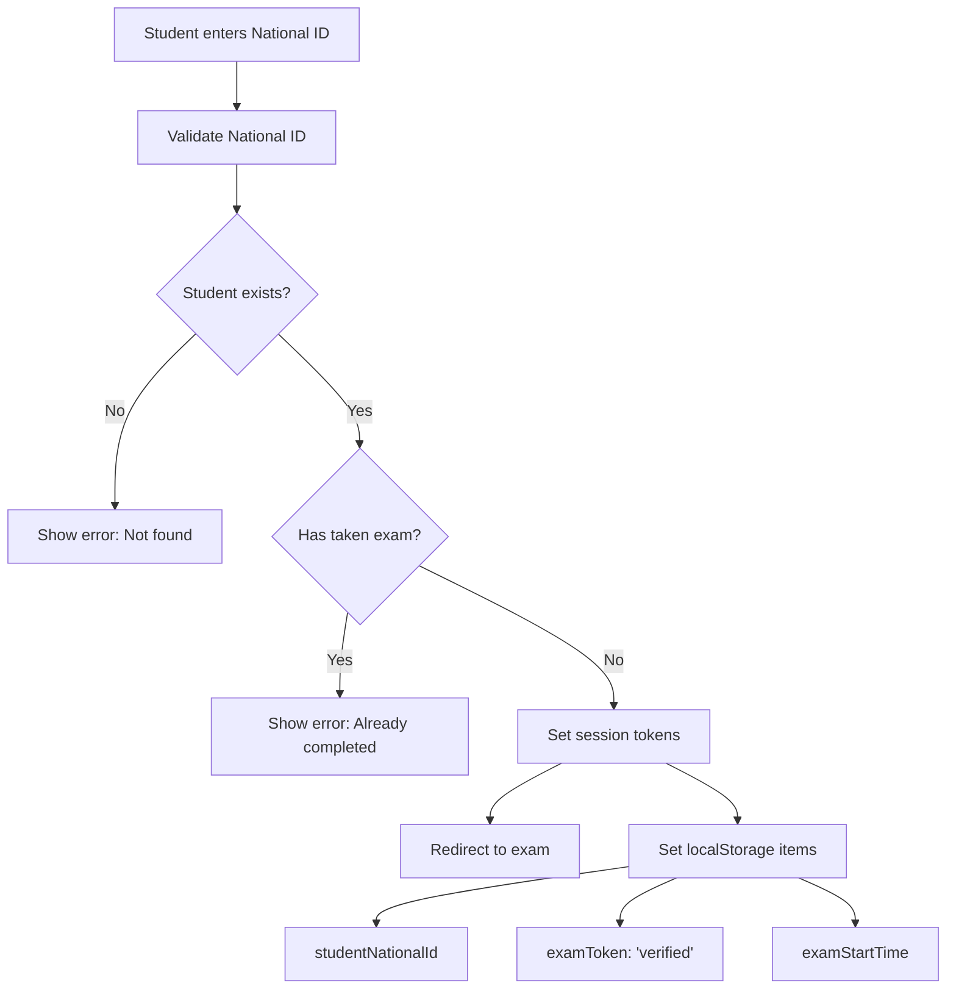
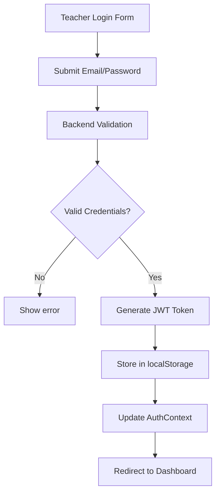
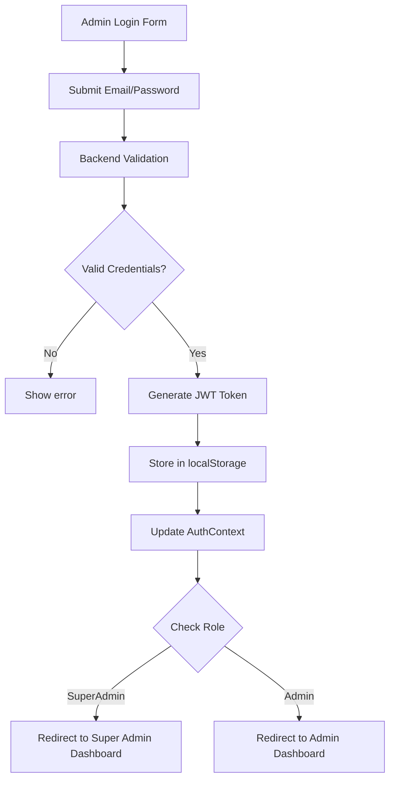

# Session Management System Documentation

## Overview

This document describes the comprehensive session management system implemented in the School Admission System. The system handles authentication, authorization, and session persistence for four distinct user types: **Students**, **Teachers**, **Admins**, and **Super Admins**.

## User Types & Authentication Levels

### 1. Students

- **Authentication**: National ID validation (no JWT tokens)
- **Session**: Temporary exam session tokens
- **Access**: Limited to exam and information completion

### 2. Teachers

- **Authentication**: Email/Password with JWT tokens
- **Session**: Persistent until logout or daily reset
- **Access**: Student registration and management

### 3. Admins

- **Authentication**: Email/Password with JWT tokens
- **Session**: Persistent until logout or daily reset
- **Access**: Student management, interview scoring, status updates

### 4. Super Admins

- **Authentication**: Email/Password with JWT tokens
- **Session**: Persistent until logout or daily reset
- **Access**: All admin features + system administration (question import, etc.)

## Token Management System

### JWT Token Structure

```json
{
  "sub": "user@email.com",
  "role": "Teacher|Admin|SuperAdmin",
  "exp": 1704067200,
  "iat": 1703980800
}
```

### Token Storage Strategy

#### Frontend Storage (`localStorage`)

```javascript
// Teacher Authentication
localStorage.setItem("teacherToken", "jwt_token_here");

// Admin Authentication
localStorage.setItem("adminToken", "jwt_token_here");

// Student Session (Non-JWT)
localStorage.setItem("studentNationalId", "12345678901234");
localStorage.setItem("examToken", "verified");
localStorage.setItem("examStartTime", "1703980800000");
```

#### Context Management (`AuthContext`)

```javascript
const AuthContext = createContext({
  adminToken: null,
  teacherToken: null,
  loginAdmin: (token) => {},
  loginTeacher: (token) => {},
  logoutAdmin: () => {},
  logoutTeacher: () => {},
  isAdminAuthenticated: false,
  isTeacherAuthenticated: false,
});
```

## Authentication Flows

### 1. Student Authentication Flow



**Session Tokens for Students:**

- `studentNationalId`: 14-digit national ID
- `examToken`: Simple "verified" string
- `examStartTime`: Unix timestamp for exam duration tracking

### 2. Teacher Authentication Flow



**JWT Token Features:**

- **Expiration**: 24 hours from creation
- **Claims**: Email and role (Teacher)
- **Storage**: `localStorage.teacherToken`
- **Auto-injection**: All API requests include token

### 3. Admin/SuperAdmin Authentication Flow



**JWT Token Features:**

- **Expiration**: 24 hours from creation
- **Claims**: Email and role (Admin/SuperAdmin)
- **Storage**: `localStorage.adminToken`
- **Auto-injection**: All API requests include token

## API Request Authentication

### Automatic Token Injection

```javascript
// Request interceptor in api.js
api.interceptors.request.use((config) => {
  // Skip auth for student validation endpoints
  if (
    config.url.includes("/Student/validate/") ||
    config.url.includes("/Student/validate-exam/") ||
    config.url.includes("/Student/submit-exam")
  ) {
    return config;
  }

  // Add appropriate token based on user type
  const adminToken = localStorage.getItem("adminToken");
  const teacherToken = localStorage.getItem("teacherToken");
  const studentToken = localStorage.getItem("studentToken");

  if (adminToken) {
    config.headers.Authorization = `Bearer ${adminToken}`;
  } else if (teacherToken) {
    config.headers.Authorization = `Bearer ${teacherToken}`;
  } else if (studentToken && config.url.includes("/Student/")) {
    config.headers.Authorization = `Bearer ${studentToken}`;
  }

  return config;
});
```

### Backend Token Validation

```csharp
// JWT Token validation in controllers
[Authorize]
public class AdminController : ControllerBase
{
    private string GetCurrentAdminEmail()
    {
        return User.FindFirst(ClaimTypes.NameIdentifier)?.Value
            ?? User.FindFirst("sub")?.Value
            ?? string.Empty;
    }

    private async Task<bool> IsSuperAdmin()
    {
        var userEmail = GetCurrentAdminEmail();
        var adminAccount = await db.Accounts
            .Include(a => a.AccountType)
            .FirstOrDefaultAsync(a => a.Email == userEmail);

        return adminAccount?.AccountType?.AccountTypeName == "SuperAdmin";
    }
}
```

## Session Persistence Strategy

### Smart Local Storage Management

```javascript
// App.jsx - Daily token cleanup
useEffect(() => {
  const today = new Date().toDateString();
  const lastClearDate = localStorage.getItem("lastClearDate");

  // Clear admin/teacher tokens daily for security
  if (lastClearDate !== today) {
    localStorage.removeItem("adminToken");
    localStorage.removeItem("teacherToken");
    localStorage.setItem("lastClearDate", today);
  }

  // Preserve student data for better UX
  // Don't clear exam-related data on app start
});
```

### Session Lifecycle Management

#### Teacher/Admin Sessions

- **Creation**: Login with valid credentials
- **Persistence**: Until logout or daily reset
- **Expiration**: 24-hour JWT token + daily cleanup
- **Cleanup**: Manual logout or automatic daily reset

#### Student Sessions

- **Creation**: National ID validation
- **Persistence**: Until exam completion or browser close
- **Expiration**: Exam completion or manual exit
- **Cleanup**: Automatic on exam completion

## Security Measures

### 1. Token Security

- **JWT Expiration**: 24-hour automatic expiration
- **Daily Cleanup**: Automatic token removal every 24 hours
- **Secure Storage**: localStorage with automatic cleanup
- **Role-based Access**: Token contains user role for authorization

### 2. API Security

- **Automatic 401 Handling**: Token cleanup on authentication failures
- **Role Validation**: Backend validates user roles for protected endpoints
- **CORS Protection**: Backend configured with proper CORS policies
- **Input Validation**: All inputs validated on both frontend and backend

### 3. Exam Security

- **Session Validation**: Exam pages validate session tokens
- **Auto-submission**: Timer-based automatic submission
- **Exit Prevention**: Security measures to prevent exam exit
- **Full-screen Enforcement**: Exam must be taken in full-screen mode

### 4. Error Handling

```javascript
// Response interceptor for 401 errors
api.interceptors.response.use(
  (response) => response,
  (error) => {
    if (error.response?.status === 401) {
      // Clear all tokens
      localStorage.removeItem("adminToken");
      localStorage.removeItem("teacherToken");
      localStorage.removeItem("studentToken");
      localStorage.removeItem("studentNationalId");
      localStorage.removeItem("examStudentData");

      // Redirect based on current page
      if (window.location.pathname.includes("/admin")) {
        window.location.href = "/admin/login";
      } else if (window.location.pathname.includes("/teacher")) {
        window.location.href = "/teacher/login";
      } else {
        window.location.href = "/verify-student";
      }
    }
    return Promise.reject(error);
  }
);
```

## Usage Phases & Session Strategy

### Phase 1: Teacher Registration (Week 1)

- **Users**: Teachers only
- **Session**: Persistent teacher tokens
- **Activity**: High-volume student registration
- **Strategy**: Daily token cleanup for security

### Phase 2: Student Information Completion (Week 2)

- **Users**: Students only
- **Session**: Temporary national ID validation
- **Activity**: Students complete information from home
- **Strategy**: Preserve student data for better UX

### Phase 3: Exam Administration (Week 3)

- **Users**: Students taking exams
- **Session**: Exam-specific tokens with time limits
- **Activity**: 500+ students taking exams simultaneously
- **Strategy**: Secure exam sessions with auto-submission

### Phase 4: Interview & Results (Week 4)

- **Users**: Admins conducting interviews
- **Session**: Persistent admin tokens
- **Activity**: Interview scoring and status updates
- **Strategy**: Role-based access control

## Token Cleanup Scenarios

### 1. Manual Logout

```javascript
// Admin logout
const logoutAdmin = () => {
  localStorage.removeItem("adminToken");
  setAdminToken(null);
  navigate("/admin/login");
};

// Teacher logout
const logoutTeacher = () => {
  localStorage.removeItem("teacherToken");
  setTeacherToken(null);
  navigate("/teacher/login");
};
```

### 2. Exam Completion

```javascript
// Exam completion cleanup
useEffect(() => {
  localStorage.removeItem("examToken");
  localStorage.removeItem("examStartTime");
  localStorage.removeItem("studentNationalId");
}, []);
```

### 3. Daily Reset

```javascript
// Daily token cleanup
if (lastClearDate !== today) {
  localStorage.removeItem("adminToken");
  localStorage.removeItem("teacherToken");
  localStorage.setItem("lastClearDate", today);
}
```

### 4. 401 Authentication Error

```javascript
// Automatic cleanup on auth failure
if (error.response?.status === 401) {
  localStorage.removeItem("adminToken");
  localStorage.removeItem("teacherToken");
  localStorage.removeItem("studentToken");
  // ... redirect to appropriate login
}
```

## Best Practices

### 1. Token Management

- ✅ Use JWT tokens for authenticated users
- ✅ Implement automatic token expiration
- ✅ Daily cleanup for security
- ✅ Role-based access control
- ❌ Don't store sensitive data in tokens
- ❌ Don't use tokens for student sessions

### 2. Session Security

- ✅ Validate sessions on protected pages
- ✅ Automatic cleanup on authentication failures
- ✅ Secure exam environment
- ✅ Input validation and sanitization
- ❌ Don't trust client-side data
- ❌ Don't expose sensitive information

### 3. User Experience

- ✅ Preserve student data across sessions
- ✅ Automatic redirects on authentication failures
- ✅ Clear error messages
- ✅ Loading states during authentication
- ❌ Don't lose user progress unnecessarily
- ❌ Don't require re-authentication for valid sessions

## Troubleshooting

### Common Issues

1. **Token Expired (401 Error)**

   - **Cause**: JWT token expired or invalid
   - **Solution**: Automatic redirect to login page
   - **Prevention**: Daily token cleanup

2. **Session Lost**

   - **Cause**: Browser refresh or localStorage cleared
   - **Solution**: Re-authentication required
   - **Prevention**: Persistent token storage

3. **Exam Session Issues**

   - **Cause**: Timer expiration or browser close
   - **Solution**: Auto-submission of answers
   - **Prevention**: Secure exam environment

4. **Role Access Denied**
   - **Cause**: Incorrect role in JWT token
   - **Solution**: Re-authentication with correct role
   - **Prevention**: Proper role validation

### Debug Information

```javascript
// Check current session state
console.log("Admin Token:", localStorage.getItem("adminToken"));
console.log("Teacher Token:", localStorage.getItem("teacherToken"));
console.log("Student National ID:", localStorage.getItem("studentNationalId"));
console.log("Exam Token:", localStorage.getItem("examToken"));
```

## Future Enhancements

### 1. Token Refresh

- Implement refresh token mechanism
- Extend session duration for active users
- Reduce authentication frequency

### 2. Session Analytics

- Track session duration and patterns
- Monitor authentication failures
- Identify security threats

### 3. Multi-factor Authentication

- Add SMS/email verification
- Implement device fingerprinting
- Enhanced security for admin accounts

### 4. Session Synchronization

- Real-time session updates
- Cross-tab session management
- Improved user experience

---

**Last Updated**: December 2024  
**Version**: 1.0  
**Maintainer**: Development Team

